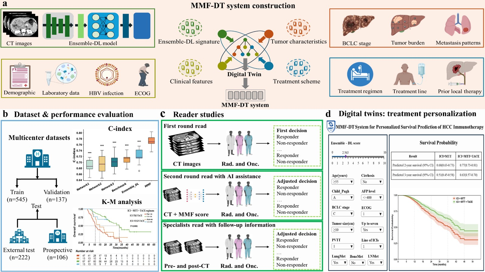

# Intelligent Digital Twin–Guided Precision Immunotherapy in Hepatocellular Carcinoma via Deep Multimodal Fusion Learning

## Overview
<div style="text-align:justify">

</div>



## 1. Software Requirements
All experiments in this study were conducted on a computing platform equipped with an NVIDIA RTX 3090 GPU, with each deep learning network implemented using the PyTorch framework. Statistical analyses and model interpretability assessments were carried out in a standardized statistical computing environment, primarily using Python 3.7.3 and R 4.3.0. Key Python dependencies included scikit-learn (v1.0.2), scikit-survival (v0.17.2), lifelines (v0.27.4), and shap (v0.41.0), among others. This setup provided strong support for efficient experimentation and reliable reproducibility of results.

## 2. Environmental settings

Please follow the guide to install and set up the project.

Clone the repository
```
git clone https://github.com/wtf633/AMF-DT.git
```
Set up a clean python3 virtual environment, i.e.
```
python3 -m venv medvenv
source medvenv/bin/activate
```
Install necessary dependencies:
```
pip install -r requirements.txt
```

## 3. Download Datasets

Data related to this study, including de-identified participant data with the accompanying data dictionary, original CT images, study protocol, and statistical analysis plan, will be made available to the scientific community upon publication. Requests for these data should be directed to the corresponding authors and must be reasonable. A signed data use agreement and institutional review board approval will be required before the release of any research data.

## 4. Training & Evaluate
Using the scripts on scripts directory to train and evaluate the model.

```
sh ./scripts/run_effnet.sh
sh ./scripts/run_ae.sh
sh ./scripts/run_m3t.sh
```

## 5. RSF-Based Ensemble Signature
To obtain a robust imaging signature, risk vectors from the three deep learning models were fused using a Random Survival Forest (RSF) instead of simple averaging. Trained with survival data, the RSF generated out-of-bag predictions that served as the final Ensemble-DL signature.

```
python RandomSurvivalForest.py
```

## 6. Digital Twin System
The MMF-DT system has been integrated into an interactive online application, freely accessible at [https://tfwang.shinyapps.io/InteractiveMedicalPrediction/](https://tfwang.shinyapps.io/InteractiveMedicalPrediction/).

```
app_digital_twins.R
```
