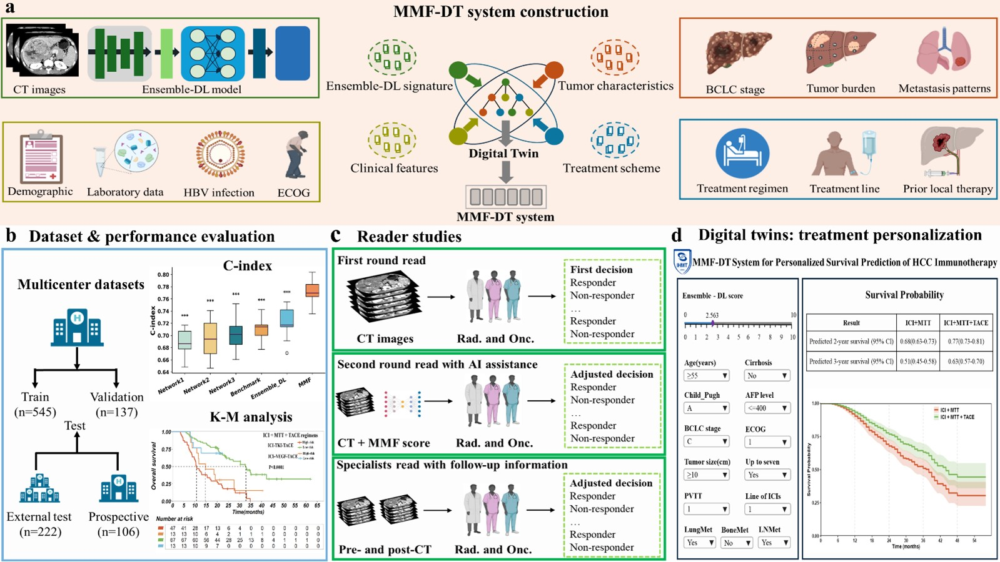

# Intelligent Digital Twin–Guided Precision Immunotherapy in Hepatocellular Carcinoma via Deep Multimodal Fusion Learning

## Overview
<div style="text-align:justify">

</div>



## 1. Environmental settings

Please follow the guide to install and set up the project.

```bash
# Clone the repository
git clone https://github.com/wtf633/MMF-DT.git

# Create conda environment
conda env create -f environment.yml
conda activate your_environment_name
```

## 2. Download Datasets

Data related to this study, including de-identified participant data with the accompanying data dictionary, original CT images, study protocol, and statistical analysis plan, will be made available to the scientific community upon publication. Requests for these data should be directed to the corresponding authors and must be reasonable. A signed data use agreement and institutional review board approval will be required before the release of any research data.

## 3. Training & Evaluate
Using the scripts on scripts directory to train and evaluate the model.

```
sh ./scripts/run_effnet.sh
sh ./scripts/run_ae.sh
sh ./scripts/run_m3t.sh
```

## 4. RSF-Based Ensemble Signature
To obtain a robust imaging signature, risk vectors from the three deep learning models were fused using a Random Survival Forest (RSF) instead of simple averaging. Trained with survival data, the RSF generated out-of-bag predictions that served as the final Ensemble-DL signature.

```
python RandomSurvivalForest.py
```

## 5. Digital Twin System
The MMF-DT system has been integrated into an interactive online application, freely accessible at [https://tfwang.shinyapps.io/InteractiveMedicalPrediction/](https://tfwang.shinyapps.io/InteractiveMedicalPrediction/).

```
app_digital_twins.R
```
